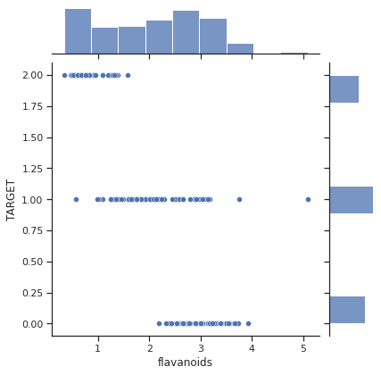

# РК1 ТМО
____________
ИУ5-62б

Васильев Денис

Вариант 3
_______________

# Данные по варианту

Номер задачи - 1

Номер набора данных для задачи - 3

### Дополнительная задача по группе (62)

Для произвольной колонки данных построить гистограмму

______________________

# Задача 1

Для заданного набора данных проведите корреляционный анализ. В случае наличия пропусков в данных удалите строки или колонки, содержащие пропуски. Сделайте выводы о возможности построения моделей машинного обучения и о возможном вкладе признаков в модель.

### Набор данных

https://scikit-learn.org/stable/modules/generated/sklearn.datasets.load_wine.html#sklearn.datasets.load_wine


```python
import numpy as np
import matplotlib.pyplot as plt
import pandas as pd
import seaborn as sns
%matplotlib inline 
sns.set(style="ticks")

from sklearn.datasets import load_wine
```


```python
wine = load_wine()
data = pd.DataFrame(wine.data, columns=wine.feature_names)
data['TARGET'] = wine.target
```


```python
data.head()
```


<div>
<style scoped>
    .dataframe tbody tr th:only-of-type {
        vertical-align: middle;
    }

    .dataframe tbody tr th {
        vertical-align: top;
    }

    .dataframe thead th {
        text-align: right;
    }
</style>
<table border="1" class="dataframe">
  <thead>
    <tr style="text-align: right;">
      <th></th>
      <th>alcohol</th>
      <th>malic_acid</th>
      <th>ash</th>
      <th>alcalinity_of_ash</th>
      <th>magnesium</th>
      <th>total_phenols</th>
      <th>flavanoids</th>
      <th>nonflavanoid_phenols</th>
      <th>proanthocyanins</th>
      <th>color_intensity</th>
      <th>hue</th>
      <th>od280/od315_of_diluted_wines</th>
      <th>proline</th>
      <th>TARGET</th>
    </tr>
  </thead>
  <tbody>
    <tr>
      <th>0</th>
      <td>14.23</td>
      <td>1.71</td>
      <td>2.43</td>
      <td>15.6</td>
      <td>127.0</td>
      <td>2.80</td>
      <td>3.06</td>
      <td>0.28</td>
      <td>2.29</td>
      <td>5.64</td>
      <td>1.04</td>
      <td>3.92</td>
      <td>1065.0</td>
      <td>0</td>
    </tr>
    <tr>
      <th>1</th>
      <td>13.20</td>
      <td>1.78</td>
      <td>2.14</td>
      <td>11.2</td>
      <td>100.0</td>
      <td>2.65</td>
      <td>2.76</td>
      <td>0.26</td>
      <td>1.28</td>
      <td>4.38</td>
      <td>1.05</td>
      <td>3.40</td>
      <td>1050.0</td>
      <td>0</td>
    </tr>
    <tr>
      <th>2</th>
      <td>13.16</td>
      <td>2.36</td>
      <td>2.67</td>
      <td>18.6</td>
      <td>101.0</td>
      <td>2.80</td>
      <td>3.24</td>
      <td>0.30</td>
      <td>2.81</td>
      <td>5.68</td>
      <td>1.03</td>
      <td>3.17</td>
      <td>1185.0</td>
      <td>0</td>
    </tr>
    <tr>
      <th>3</th>
      <td>14.37</td>
      <td>1.95</td>
      <td>2.50</td>
      <td>16.8</td>
      <td>113.0</td>
      <td>3.85</td>
      <td>3.49</td>
      <td>0.24</td>
      <td>2.18</td>
      <td>7.80</td>
      <td>0.86</td>
      <td>3.45</td>
      <td>1480.0</td>
      <td>0</td>
    </tr>
    <tr>
      <th>4</th>
      <td>13.24</td>
      <td>2.59</td>
      <td>2.87</td>
      <td>21.0</td>
      <td>118.0</td>
      <td>2.80</td>
      <td>2.69</td>
      <td>0.39</td>
      <td>1.82</td>
      <td>4.32</td>
      <td>1.04</td>
      <td>2.93</td>
      <td>735.0</td>
      <td>0</td>
    </tr>
  </tbody>
</table>
</div>


```python
data.info()
```

    <class 'pandas.core.frame.DataFrame'>
    RangeIndex: 178 entries, 0 to 177
    Data columns (total 14 columns):
     #   Column                        Non-Null Count  Dtype  
    ---  ------                        --------------  -----  
     0   alcohol                       178 non-null    float64
     1   malic_acid                    178 non-null    float64
     2   ash                           178 non-null    float64
     3   alcalinity_of_ash             178 non-null    float64
     4   magnesium                     178 non-null    float64
     5   total_phenols                 178 non-null    float64
     6   flavanoids                    178 non-null    float64
     7   nonflavanoid_phenols          178 non-null    float64
     8   proanthocyanins               178 non-null    float64
     9   color_intensity               178 non-null    float64
     10  hue                           178 non-null    float64
     11  od280/od315_of_diluted_wines  178 non-null    float64
     12  proline                       178 non-null    float64
     13  TARGET                        178 non-null    int64  
    dtypes: float64(13), int64(1)
    memory usage: 19.6 KB


Как видно из результата выполнения предыдущего кода, пропусков в данных нет.


```python
data.describe()
```


<div>
<style scoped>
    .dataframe tbody tr th:only-of-type {
        vertical-align: middle;
    }

    .dataframe tbody tr th {
        vertical-align: top;
    }

    .dataframe thead th {
        text-align: right;
    }
</style>
<table border="1" class="dataframe">
  <thead>
    <tr style="text-align: right;">
      <th></th>
      <th>alcohol</th>
      <th>malic_acid</th>
      <th>ash</th>
      <th>alcalinity_of_ash</th>
      <th>magnesium</th>
      <th>total_phenols</th>
      <th>flavanoids</th>
      <th>nonflavanoid_phenols</th>
      <th>proanthocyanins</th>
      <th>color_intensity</th>
      <th>hue</th>
      <th>od280/od315_of_diluted_wines</th>
      <th>proline</th>
      <th>TARGET</th>
    </tr>
  </thead>
  <tbody>
    <tr>
      <th>count</th>
      <td>178.000000</td>
      <td>178.000000</td>
      <td>178.000000</td>
      <td>178.000000</td>
      <td>178.000000</td>
      <td>178.000000</td>
      <td>178.000000</td>
      <td>178.000000</td>
      <td>178.000000</td>
      <td>178.000000</td>
      <td>178.000000</td>
      <td>178.000000</td>
      <td>178.000000</td>
      <td>178.000000</td>
    </tr>
    <tr>
      <th>mean</th>
      <td>13.000618</td>
      <td>2.336348</td>
      <td>2.366517</td>
      <td>19.494944</td>
      <td>99.741573</td>
      <td>2.295112</td>
      <td>2.029270</td>
      <td>0.361854</td>
      <td>1.590899</td>
      <td>5.058090</td>
      <td>0.957449</td>
      <td>2.611685</td>
      <td>746.893258</td>
      <td>0.938202</td>
    </tr>
    <tr>
      <th>std</th>
      <td>0.811827</td>
      <td>1.117146</td>
      <td>0.274344</td>
      <td>3.339564</td>
      <td>14.282484</td>
      <td>0.625851</td>
      <td>0.998859</td>
      <td>0.124453</td>
      <td>0.572359</td>
      <td>2.318286</td>
      <td>0.228572</td>
      <td>0.709990</td>
      <td>314.907474</td>
      <td>0.775035</td>
    </tr>
    <tr>
      <th>min</th>
      <td>11.030000</td>
      <td>0.740000</td>
      <td>1.360000</td>
      <td>10.600000</td>
      <td>70.000000</td>
      <td>0.980000</td>
      <td>0.340000</td>
      <td>0.130000</td>
      <td>0.410000</td>
      <td>1.280000</td>
      <td>0.480000</td>
      <td>1.270000</td>
      <td>278.000000</td>
      <td>0.000000</td>
    </tr>
    <tr>
      <th>25%</th>
      <td>12.362500</td>
      <td>1.602500</td>
      <td>2.210000</td>
      <td>17.200000</td>
      <td>88.000000</td>
      <td>1.742500</td>
      <td>1.205000</td>
      <td>0.270000</td>
      <td>1.250000</td>
      <td>3.220000</td>
      <td>0.782500</td>
      <td>1.937500</td>
      <td>500.500000</td>
      <td>0.000000</td>
    </tr>
    <tr>
      <th>50%</th>
      <td>13.050000</td>
      <td>1.865000</td>
      <td>2.360000</td>
      <td>19.500000</td>
      <td>98.000000</td>
      <td>2.355000</td>
      <td>2.135000</td>
      <td>0.340000</td>
      <td>1.555000</td>
      <td>4.690000</td>
      <td>0.965000</td>
      <td>2.780000</td>
      <td>673.500000</td>
      <td>1.000000</td>
    </tr>
    <tr>
      <th>75%</th>
      <td>13.677500</td>
      <td>3.082500</td>
      <td>2.557500</td>
      <td>21.500000</td>
      <td>107.000000</td>
      <td>2.800000</td>
      <td>2.875000</td>
      <td>0.437500</td>
      <td>1.950000</td>
      <td>6.200000</td>
      <td>1.120000</td>
      <td>3.170000</td>
      <td>985.000000</td>
      <td>2.000000</td>
    </tr>
    <tr>
      <th>max</th>
      <td>14.830000</td>
      <td>5.800000</td>
      <td>3.230000</td>
      <td>30.000000</td>
      <td>162.000000</td>
      <td>3.880000</td>
      <td>5.080000</td>
      <td>0.660000</td>
      <td>3.580000</td>
      <td>13.000000</td>
      <td>1.710000</td>
      <td>4.000000</td>
      <td>1680.000000</td>
      <td>2.000000</td>
    </tr>
  </tbody>
</table>
</div>


```python
corr_matrix = data.corr()
```


```python
corr_matrix['TARGET']
```


    alcohol                        -0.328222
    malic_acid                      0.437776
    ash                            -0.049643
    alcalinity_of_ash               0.517859
    magnesium                      -0.209179
    total_phenols                  -0.719163
    flavanoids                     -0.847498
    nonflavanoid_phenols            0.489109
    proanthocyanins                -0.499130
    color_intensity                 0.265668
    hue                            -0.617369
    od280/od315_of_diluted_wines   -0.788230
    proline                        -0.633717
    TARGET                          1.000000
    Name: TARGET, dtype: float64


```python
corr_matrix_kendall = data.corr(method='kendall')
corr_matrix_kendall['TARGET']
```


    alcohol                        -0.238984
    malic_acid                      0.247494
    ash                            -0.038085
    alcalinity_of_ash               0.449402
    magnesium                      -0.184992
    total_phenols                  -0.590404
    flavanoids                     -0.725255
    nonflavanoid_phenols            0.379234
    proanthocyanins                -0.450225
    color_intensity                 0.065124
    hue                            -0.479229
    od280/od315_of_diluted_wines   -0.607572
    proline                        -0.406260
    TARGET                          1.000000
    Name: TARGET, dtype: float64


```python
corr_matrix_spearman = data.corr(method='spearman')
corr_matrix_spearman['TARGET']
```


    alcohol                        -0.354167
    malic_acid                      0.346913
    ash                            -0.053988
    alcalinity_of_ash               0.569792
    magnesium                      -0.250498
    total_phenols                  -0.726544
    flavanoids                     -0.854908
    nonflavanoid_phenols            0.474205
    proanthocyanins                -0.570648
    color_intensity                 0.131170
    hue                            -0.616570
    od280/od315_of_diluted_wines   -0.743787
    proline                        -0.576383
    TARGET                          1.000000
    Name: TARGET, dtype: float64


```python
plt.figure(figsize=(20,20))
sns.heatmap(corr_matrix, annot=True, fmt='.3f')
```


    <AxesSubplot:>


    

    


### Примечание

По результатам корреляционного анализа разными методами можем заметить, что самая сильная корреляция целевого признака наблюдается со следующими признаками:

- flavanoids
- od280....
- total_phenols


```python
fig, axs = plt.subplots(ncols=3, figsize=(30,10))
sns.regplot(x=data['flavanoids'], y=data['TARGET'], ax = axs[0])
sns.regplot(x=data['total_phenols'], y=data['TARGET'], ax = axs[1])
sns.regplot(x=data['od280/od315_of_diluted_wines'], y=data['TARGET'], ax = axs[2])
```


    <AxesSubplot:xlabel='od280/od315_of_diluted_wines', ylabel='TARGET'>


    

    


```python
sns.boxplot(x=data['TARGET'])
```


    <AxesSubplot:xlabel='TARGET'>


    

    


```python
plt.figure(figsize=(12,6))
sns.pairplot(data)
```


    <seaborn.axisgrid.PairGrid at 0x7fa0de9cf760>


    <Figure size 864x432 with 0 Axes>


    

    


```python
sns.jointplot(x = "flavanoids", y = "TARGET", kind="scatter", data = data)
```


    <seaborn.axisgrid.JointGrid at 0x7fa0b98c8e80>


    

    


```python
fig, ax = plt.subplots(figsize=(10,10)) 
sns.scatterplot(ax=ax, x='flavanoids', y='TARGET', data=data, hue='alcohol')
```


    <AxesSubplot:xlabel='flavanoids', ylabel='TARGET'>


    

    


## Вывод

Оба признака flavanoids и total_phenols хорошо коррелируют как друг с другом, так и с целевым признаком. Для дальнейшего анализа можно отбросить один из этих признаков.

Также из выборки можно исключить признаки ash и color_intensity, которые имеют очень слабую корреляцию с целевым признаком.


```python

```
